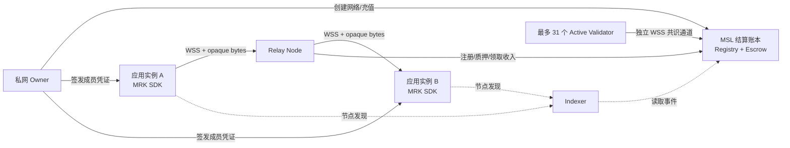

# MRK：基于 MRK 专用结算账本的 WSS 私网转发基础设施

状态：方案草案（MVP）  
定位：为 VPN、代理、远程访问等上层应用提供通用的私网成员认证、WSS 字节转发和节点结算能力

## 1. 产品边界

MRK 本身不是 VPN，而是一个无需许可的中继基础设施：

- 任何人都可以运行 Relay Node，公开价格并通过转发流量获得收入。
- 任何人都可以创建私有网络，并向自己的应用实例签发成员凭证。
- 网络成员通过 Relay 的 WSS 接口互相发送不透明二进制数据。
- 上层应用决定二进制数据代表 IP 包、代理协议、RPC、文件块还是其他内容。
- MRK 专用结算账本（MSL）负责节点注册、质押、资金托管和结算，不参与实时转发。

### 基础设施明确不负责

- 不创建 TUN/TAP 设备，不分配虚拟 IP，不维护路由表。
- 不实现 VPN 协议、TCP/UDP 转发、DNS 或公网出口。
- 不处理 NAT 穿透、打洞或客户端直连，所有数据都经过 Relay。
- 不解析或修改上层载荷。
- 不保证端到端加密。WSS 只保护“客户端到 Relay”这一跳；若不能信任 Relay，上层应用必须在发送前自行加密载荷。
- 协议内只使用 MRK 计价、质押和结算。协议不验证真人，也不按身份提供用户免费额度；任何人都可以无需审批运行 Relay。Genesis 固定铸造 5 亿 MRK 到无私钥国库，另外 5 亿只按合格节点在线时长释放。MSL 不实现通用智能合约、虚拟机、Gas 市场或其他资产。完整规则见[MRK 专用结算账本、节点发行与治理协议](./blockchain.md)。

## 2. 核心架构



| 组件 | 职责 |
| --- | --- |
| Client SDK | 连接 WSS、认证成员、逻辑通道复用、背压、重连、付款凭证 |
| Relay Node | 验证成员、维护在线目录、转发不透明数据、计量、限流 |
| Owner CLI/API | 创建私网、签发/撤销成员、配置预算 |
| Node Registry | 节点身份、WSS 地址、价格、能力、质押状态 |
| Network Registry | 网络承诺、Owner 管理密钥、可选撤销根 |
| Escrow | 网络充值、设备支付授权、Relay 结算 |
| Indexer | 索引 MSL 最终事件，提供可替换的节点查询接口 |
| Validator Committee | 通过 PROPOSE/PREVOTE/PRECOMMIT 最终确认 MSL 区块，不接触 Relay DATA |

## 3. 私网和成员模型

### 3.1 私网

私网只是一个隔离的成员命名空间，不包含任何三层网络语义：

```text
PrivateNetwork {
  network_id: random 32 bytes
  owner_public_key
  created_at
}
```

MSL 仅保存 `network_commitment = hash(network_id)` 和 Owner 地址。`network_id` 由 Owner 通过安全渠道交给成员，避免公开枚举私网。

### 3.2 成员凭证

Owner 离线签发短期凭证：

```text
MemberCredential {
  version
  network_id
  member_id: random 16 or 32 bytes
  member_public_key
  permissions: [connect, send, receive]
  max_connections
  serial
  issued_at
  expires_at
  owner_signature
}
```

`member_id` 仅用于寻址，不应使用钱包地址、邮箱、设备名等可识别信息。凭证建议有效 24 小时至 7 天，成员定期续期。

紧急撤销使用 Owner 签名的 `RevocationList`。Relay 可从多个 Indexer 获取列表，但必须自行验证签名。后续可以把撤销列表的 Merkle Root 锚定上链。

## 4. WSS 转发接口

### 4.1 建立连接

客户端连接：

```http
GET /v1/relay HTTP/1.1
Host: relay.example.com
Upgrade: websocket
Connection: Upgrade
Sec-WebSocket-Protocol: mrk.relay.v1
```

要求：

- 仅允许 TLS 1.3 的 `wss://` 端点。
- Upgrade 成功后，Relay 首先发送一次性 `CHALLENGE`，客户端必须在 10 秒内返回 `HELLO`。
- `HELLO.proof` 是成员私钥对 challenge、Relay 身份、成员凭证哈希和时间戳的签名，防止历史认证消息被重放。
- Relay 验证 Owner、成员凭证、有效期、撤销状态和连接数限制。
- 成功后，一个 WSS 连接代表一个 `(network_id, member_id)` 在线实例。
- 同一成员多端登录是否允许，由凭证中的 `max_connections` 决定。

### 4.2 帧协议

WebSocket 消息统一使用二进制编码。MVP 推荐固定长度头部，后续可演进到 Protobuf；不要在热路径使用 JSON。

```text
FrameHeader {
  version:       u8
  frame_type:    u8
  flags:         u16
  channel_id:    u32
  sequence:      u64
  payload_len:   u32
}
```

帧类型：

| 类型 | 方向 | 作用 |
| --- | --- | --- |
| `CHALLENGE` | Relay → Client | 提供一次性认证随机数和 Relay 身份 |
| `HELLO` | Client → Relay | 提交成员凭证、challenge 签名、支付授权和协议能力 |
| `WELCOME` | Relay → Client | 返回连接 ID、限制、报价快照和心跳参数 |
| `OPEN` | Client → Relay | 请求与目标 `member_id` 建立逻辑通道 |
| `INCOMING` | Relay → Client | 通知有成员请求建立通道 |
| `ACCEPT` / `REJECT` | Client → Relay | 接受或拒绝逻辑通道 |
| `DATA` | 双向 | 承载上层应用的不透明二进制数据 |
| `CLOSE` | 双向 | 关闭一个逻辑通道 |
| `VOUCHER_REQUEST` | Relay → Client | 请求更新累计付款凭证 |
| `VOUCHER` | Client → Relay | 返回签名的累计付款凭证 |
| `PING` / `PONG` | 双向 | 应用层存活检测和延迟测量 |
| `ERROR` | Relay → Client | 返回机器可读错误码 |

`OPEN` 只包含目标 `member_id` 和可选的不透明应用元数据。Relay 必须确认双方属于同一私网，不能跨 `network_id` 建立通道。

### 4.3 SDK 对上层应用的最小接口

```text
RelayClient.connect(options) -> RelayConnection

RelayConnection.open(peer_id, metadata?) -> Channel
RelayConnection.on_incoming(handler)
RelayConnection.on_state_change(handler)
RelayConnection.close()

Channel.send(bytes) -> Promise<void>
Channel.on_data(handler)
Channel.on_close(handler)
Channel.close(code?, reason?)
```

语义约定：

- `send()` 成功只表示 Relay 已接受数据，不表示目标应用已经处理。
- 每条 `DATA` 保留 WebSocket 消息边界；基础设施不解释载荷。
- 同一通道内按 `sequence` 有序，重连后旧通道失效，由上层应用决定是否重放业务数据。
- SDK 必须暴露背压；发送缓冲超过阈值时 `send()` 等待或失败，不能无限占用内存。
- WSS 基于 TCP，存在队头阻塞。这是当前协议选择的已知取舍，上层不要把它当成无序数据报服务。

### 4.4 Relay 内部转发表

Relay 只维护在线连接和逻辑通道：

```text
(network_tag, member_tag) -> websocket_connection
(source_connection, channel_id) -> destination_connection
```

Relay 可以看到网络标签、通信双方、消息大小和时间，但不应记录原始 `network_id`、成员凭证或 `DATA` 载荷。路由 tag 应由每次连接随机派生，日志中只保留短期 tag。

### 4.5 连接限制

建议 MVP 默认值：

- 单条 WebSocket 消息最大 1 MiB；节点可以公布更低限制。
- 单连接最多 256 个逻辑通道。
- 发送队列默认 8 MiB，超过后执行背压。
- `HELLO` 后 10 秒内未完成认证则断开。
- 空闲 30 秒发送一次心跳，连续两个周期无响应则断开。
- Relay 按 IP、成员、私网分别限制握手速率、连接数和带宽。

## 5. 节点发现与生命周期

### 5.1 节点注册

任何人都可以生成节点身份并向 `NodeRegistry` 注册：

```text
NodeRecord {
  node_id
  node_owner_key
  relay_key
  wss_endpoint
  reward_ip
  ip_slot
  protocol_versions
  price_per_gib
  min_session_price
  max_message_size
  region
  service_bond
  service_bond_unlock_at
  registered_at
  warmup_until
  status
}
```

节点必须控制 WSS 域名及其 TLS 证书，但不由操作者手工填写公网 IP。Registry 从 WSS Endpoint 的 DNS 解析结果自动选择候选 `reward_ip`，运行时重新解析校验，外部 Probe 再确认该地址确实可达。双栈域名优先选择公网 IPv4；没有公网 IPv4 时选择规范排序后的首个公网 IPv6。公网 IPv4 按完整地址形成槽位，IPv6 按 `/64` 前缀形成槽位；同一槽位最多一个 Node 获得在线奖励、治理和 Validator 资格。Registry 可保存签名元数据的 URI/哈希，避免每次更新价格和容量都产生 MSL 状态操作；所有元数据必须由节点身份密钥签名。

多个外部 Probe 必须使用声明的 `reward_ip` 直接发起 WSS 连接，同时携带节点域名的 TLS SNI，确认域名、证书、Node 签名和公网地址属于同一服务。不同端口、域名、进程或容器不能绕过槽位唯一性；共享 CDN、共享反向代理或共享 NAT 只能获得一个槽位。

Availability 有显式且受状态根保护的两阶段信任模型。Active Validator 少于 7 个时为 `NODE1_TRUSTED`，协议绝对信任 Node 1 的一票证明并允许 Node 1 自证；在 Epoch 边界拥有至少 7 个 Active Validator 后切换为 `MULTI_VALIDATOR`，默认 Primary 5 选 3并禁止目标自证。委员会再次低于 7 席时自动回退到 `NODE1_TRUSTED`，恢复到至少 7 席后可再次进入 `MULTI_VALIDATOR`。首次激活时间和 Epoch 作为历史记录保留，后续切换不会覆盖。

去中心化阶段的 Probe Challenge 和检查时刻来自验证者 Owner Key 对 Ledger、Epoch、Slot、目标、验证者及 `PRIMARY/AUDIT` 角色的签名 Ticket。目标在收到网络请求前不能预测 Ticket。默认 5% Slot 在至少 9 个 Active Validator 时额外选择与目标及 Primary 集合互不重叠的 3 个 Auditor，并要求 2 票；被审计 Slot 只有同时达到 Primary 和 Audit 法定票数才记账。单次网络失败不触发罚没；连续达到治理阈值仍缺少终局成功证明时，状态机才罚没 Service Bond。Validator Bond 仍只应由双签等密码学冲突证据处罚。

上述状态结构、Ticket 域和 `mrk-probe-v1` Payload 属于尚未正式发布的协议版本 1。IP Slot 所有权、Reward IP 更新以及退出释放均属于 v1 发布前的确定性区块状态转换。发布前可直接调整协议及磁盘格式，不提供早期开发数据的兼容或静默迁移；已有测试数据应重建，或通过显式可信 Bootstrap 替换。

注册和开始运行不要求预先持有 MRK。节点最初获得的在线时长奖励优先形成默认 500 MRK 的 Service Bond；Bond 只能约束有客观证据的违规，不能证明节点一定快速或稳定。

### 5.2 发现接口

任一 Node 的公开 `mrk.rpc.v1` 接口直接提供两种只读视图：

```bash
mrk registry list [--status active] [--validator] [--limit 50] [--cursor NODE_ID]
mrk registry show --node-id NODE_ID
mrk discover [--limit 50] [--cursor NODE_ID]
```

`registry` 是终局 MSL `NodeRegistry` 的完整登记视图，默认保留并返回非活跃及历史 Node；`discover` 是供客户端连接 Relay 的收窄视图，只返回状态为 `ACTIVE`、最近一次已终局 Probe 尚在 `probe_validity_seconds` 窗口内、且 `ip_slot` 仍绑定到该 Node 的记录。本机 Heartbeat 不进入状态根，因此不参与发现条件。两类列表都按 `node_id` 升序并使用排他游标分页，单页最多 1,000 项；响应的 `next_cursor` 为空表示已经读完。价格和 Bond 的 base-unit 字段使用十进制字符串，避免 JSON/JavaScript 整数精度损失。

Indexer 可以缓存这些终局结果并附加区域、延迟等部署数据，但客户端始终可以直接查询 MSL Node 的公共 RPC，因此 Indexer 不属于信任根。

客户端按 WSS 握手延迟、价格、历史可用性、质押和节点容量本地选择 Relay。不同成员必须连接同一个 Relay 才能建立逻辑通道；由私网配置指定主 Relay 和备用 Relay，或由 SDK 计算两端候选集的交集。

### 5.3 运行与退出

节点运行时：

1. 监听 HTTPS/WSS，发布签名在线声明。
2. 验证成员凭证并建立在线目录。
3. 为每个连接固定一个有有效期的报价快照。
4. 转发 `DATA`，执行限流和背压，累计可计费 payload 字节。
5. 定期请求付款凭证，保留每个会话最新有效凭证。

Owner 签署 `DrainNode` 后先进入 `DRAINING`，该操作所在区块终局时确定性转为 `EXITED` 并释放 IP Slot。已经归属的 `claimable_reward` 保留，尚未归属的线性释放余额退回 Treasury。由奖励形成的 Service Bond 从终局时间起默认锁定 30 天，之后由 Owner 签署 `WithdrawServiceBond` 转入 Reward 账户。若 Node 是 Validator，必须先退出委员会并取回 Validator Bond。

连续 7 天没有新的终局 Availability 成功证明属于可客观重放的长期离线。下一终局区块会强制该 Node 退出并释放 IP Slot，将 Service Bond 与尚未归属的线性奖励一并转入 Treasury，且不建立 Bond 解锁时间；已经归属的奖励不罚没。阈值由 Critical 参数 `offline-slash-seconds` 控制，本机 Heartbeat 不作为证据。没有终局区块时协议时间不推进，罚没只能在共识恢复后执行。

### 5.4 Validator 委员会与共识接口

Relay Node 和 Validator 是同一个 `node_id` 的两种职责。正常 Relay 不自动获得出块权；达到治理资格后，Node 可用已经获得的 `50,000 MRK` 锁定 Validator Bond，进入候选池。Active Committee 最多 31 席；候选不超过 31 时全员进入，超过时每个 Epoch 确定性轮换至多 10 席，保证至少 21 席连续性。

委员会只有达到 4 个 Active Validator 才接管出块。少于 4 个时始终由 Node 1 出块；这不会改变治理边界，20 个 Governance-Eligible Node 以上仍必须通过分布式提案投票。

共识使用独立连接，不复用成员转发通道：

```http
GET /v1/consensus HTTP/1.1
Upgrade: websocket
Sec-WebSocket-Protocol: mrk.consensus.v1
```

双方必须是当前 Active Validator，并进行双向 Owner Key 认证：服务端先签署包含自身 Node ID、公钥、随机数和时间戳的新鲜 Challenge，连接端验证后再对 Challenge 回应签名。认证完成后先 Gossip 已签名的待处理 Operation，再由相同 `(height, round)` 的节点使用 `SYNC_REQUEST/SYNC_STATE` 双向对齐 Proposal、PREVOTE 和 PRECOMMIT。落后节点通过 `CATCH_UP_REQUEST/CATCH_UP_CHUNK` 分块取得已终局 Block、Operation 正文和最终检查点；只有链连续、可信委员会的法定人数连续、Commit Certificate、Operation 签名和最终状态根全部通过本地验证后才原子替换临时状态。每个高度由 `(height, round)` 确定提议者，其他委员先 PREVOTE，再在同值取得 `floor(2N/3)+1` PREVOTE 后 PRECOMMIT；相同数量的 PRECOMMIT 构成最终 Commit Certificate。Round 超时从 10 秒指数增长，最高 60 秒；进入 Proposal 和取得 PREVOTE 法定票数会分别重置当前步骤计时，即使票数随后停滞也会继续换轮。取得 PREVOTE 法定票数的值跨轮保留，下一提议者只能重提相同状态根和有序 Operation 集；Validator Lock 允许同值的新 Block Hash，拒绝换值。更高 Peer Round 只能在本机超时成立后逐轮追赶，单 Peer 不能强制任意跳轮。Relay 的 `mrk.relay.v1` DATA 永远不会进入该通道。

`mrk node run` 在后台每 2 秒与 Active Committee 中最多 4 个确定性环形邻居同步，并确保当前 Proposer 在目标集合中；邻居选择同时覆盖前后方向，使 31 席委员会无需建立全连接。每次连接与同步最长 60 秒，共识消息正文最大 16 MiB；所有 Operation、Proposal、Vote 和 Catch-up 数据在写入 redb 前继续执行完整验证。`FULL` 保存并可提供完整历史；`LITE` 对早于本地裁剪点的请求返回明确错误。Peer Discovery 和外部可信快照恢复仍是独立边界。

状态根只排除每台机器独有的 Heartbeat；Catch-up 保留接收者自己的 Heartbeat。已签名 Availability Slot、Probe 时间/次数、Epoch/累计合格秒数、委员会、双签证据、账户和所有已结算协议状态均受状态根约束并从已验证检查点同步。奖励只能由达到法定票数的 Availability 证明驱动，不能直接信任 Validator 或 Relay 本机计时。

当前 CLI 已实现委员会、跨轮有效值与 Lock 恢复、双向 Owner Key 认证、WSS 待处理操作与同轮对象同步、后台邻居 Gossip、运行时自动投票，以及独立 redb 数据目录之间的已终局区块追赶。冲突待处理候选按统一键排序，提议者和投票者都从上一终局检查点通过内存 redb 调用正式状态转换函数重放，因此操作到达顺序不会决定状态根。新数据目录使用显式固定状态根的公开 WSS Bootstrap，普通非 Validator Node 也持续执行公开 Catch-up；多 Seed 自动发现和根的外部发布仍属于部署层。

## 6. 计费与节点奖励

### 6.1 奖励来源

节点收入严格分为两部分：

```text
节点发行收入 = 固定 Epoch 铸币预算 × 节点合格在线秒数权重占比
流量服务收入 = 私网用户按累计 Voucher 支付的已有 MRK
```

Genesis 固定把 5 亿 MRK 铸入无私钥 Treasury；Genesis 之后，新增 MRK 只有“合格节点在线时长”一个释放渠道。注册、用户身份、流量、连接数、Validator 出批次、治理或 Treasury 支出均不能继续铸币。流量付款和国库支出只转移已有 MRK；Relay 与客户端即使合谋制造虚假流量，也不能扩大 Epoch 发行预算。

新 Node 不需要预先持有 MRK。除 Genesis Node 1 外，注册时按当时的 `warmup-seconds` 固化 `warmup_until`；默认考察期 1 天，Critical 治理可在 0 到 365 天范围修改，但只影响修改后注册的 Node。Node 1 注册后立即为 `ACTIVE`，且 `warmup_until = registered_at`。节点完成预热后，每个 60 秒 Availability Slot 由验证节点按照秘密 Owner-signed Ticket 规定的时刻直连登记 `reward_ip` 并验证 Endpoint TLS 与 Relay Key 签名。少于 7 个 Active Validator 时绝对信任 Node 1 的一票证明并允许自证；达到至少 7 个 Active Validator 的 Epoch 边界后切换为默认 Primary 5 选 3，跌破门槛时自动回退。5% Slot 在至少 9 席时再执行 Auditor 3 选 2。达到全部所需法定票数的 Slot 才累计 Node Seconds，最初获得的奖励先形成 Service Bond；扣除 Bond 后的奖励默认 10% 立即可领取、90% 在 180 天内线性释放，并且只有最终确认区块跨越 Epoch 边界时才推进释放状态。奖励查询保持只读，领取只转移已经最终确认的可领取余额。`reward-immediate-bps` 与 `reward-vesting-seconds` 都是下一 Epoch 快照生效的 Critical 治理参数。所有普通 Node 使用相同释放公式，没有早期节点额外奖励。Active Validator 在 Epoch 检查点签名率达到 95% 时使用 `1.25×` Node Seconds 权重；加成只改变固定预算的分配，不增加发行总额。

### 6.2 Genesis 国库

Genesis 将 5 亿 MRK 直接记入状态机内的 Treasury 余额，不生成国库私钥或普通账户。国库治理只计算累计合格运行满 180 天的成熟 Node，且至少需要 20 个成熟 Node 和 4 个 Active Validator 才能创建 Critical `TreasurySpend`。Node Power 只来自累计合格运行天数（180 天封顶），不受 MRK 或 Validator Bond 影响；单 Node 上限为动态 `max(1%, 1/N)`。

提案必须同时取得成熟 Node 快照 Power 至少 `2/3` YES 和 Validator 快照至少 `2/3` YES，经过 14 天投票和 30 天时间锁。时间锁期间超过 `1/3` 成熟 Node 快照 Power 的签名 Veto 会取消提案。创建和执行时均检查单笔不超过当前国库 1%、滚动 90 天累计不超过 2%、滚动 365 天不超过 5%。执行由状态机直接扣减 Treasury、增加收款地址余额，不能调用铸币入口。

CLI 只提供余额/历史查询和治理提案，不提供国库密钥或直接发送接口。链上保存收款地址、金额与外部材料的 SHA-256 引用，不保存合同或个人信息全文。

### 6.3 累计双签名流量回执

Owner 先向 `NetworkEscrow` 充值，再创建绑定 Node、双方 Member、随机 Session ID、固定 `price_per_gib`、限额和有效期的 `PaymentAuthorization`。授权必须最终确认后才能打开 Relay Channel，限额在创建时原子预留，但不会预付给 Node。

每个方向独立累计 DATA Sequence、真实 Payload 字节和 Transcript Hash。达到 64 MiB 或自首个 DATA 起 2 分钟后，发送方签署 `SenderCheckpoint`，接收方核对本地已收到的相同前缀并签署 `ReceiverReceipt`；Node 只有验证双签名后才继续该方向。正常关闭会为不足一个窗口的尾部生成 Final Checkpoint。计费不包含 WSS/TLS/TCP 头、Padding 或控制帧。

Node 在本地 redb 只保留每个授权、每个方向最新的累计回执，默认每 5 分钟批量提交，重启后恢复。链上用“新累计总价减该方向已结算金额”计算增量，避免按窗口向上取整造成重复收费。授权到期后有 7 天领取期，余款随后退回 Network Escrow。

客户端根据自己的累计发送量和报价复算金额后才签名。未按时更新凭证时，Relay 暂停该连接的 `DATA` 转发；最大信用风险限制为一个计费步长。

Relay 最终只需向 MSL 提交每个连接最新的凭证。状态机保存已结算的最高 `sequence` 和累计金额，防止重复领取；多个最终凭证可以合并为一个结算批次操作。

## 7. MRK 专用结算账本

WSS 数据面只依赖三个版本化账本接口：

- `NodeRegistry`：查询 Node、Owner/Relay 密钥、WSS 端点、报价和合格状态；
- `NetworkRegistry`：查询私网承诺与 Owner 管理密钥；
- `NetworkEscrow`：验证累计付款凭证并使用 MRK 向 Relay 结算。

节点在线发行、节点质押和节点治理由同一个确定性状态机中的其他固定模块提供。它们不是用户可部署的智能合约。完整模块边界、发行约束和治理门槛见[MRK 专用结算账本、节点发行与治理协议](./blockchain.md)。

MSL 不裁决延迟、掉线、消息丢失等主观质量问题。Probe 失败只停止后续在线计时；自动罚没仅适用于冲突检查点签名、重复领取等具有客观签名证据的行为。

MSL 在 Governance-Eligible Node 少于 20 个或 Active Validator 少于 4 个时，由 Node 1 排序、执行并签署追加式结算批次，所有操作日志、状态根和快照可公开重放；SDK 固定最近检查点，任何人可运行只读 Witness 检测冲突签名。两项门槛同时满足后，切换到最多 31 席的等权 Validator 委员会，批次必须取得 `floor(2N/3)+1` 个 PRECOMMIT 才最终确认。WSS DATA 和单个数据包永远不进入 MSL。

## 8. 安全和隐私边界

| 风险 | 缓解措施 | 仍然存在的边界 |
| --- | --- | --- |
| Relay 读取载荷 | 上层应用在 `send()` 前端到端加密 | WSS 本身不能防 Relay 读取明文 |
| Relay 修改数据 | 上层载荷认证；SDK 的帧序号检测异常 | Relay 可以丢弃、延迟数据 |
| 跨私网转发 | Owner 签名凭证和 network 隔离键 | Owner 本身是私网信任根 |
| 凭证盗用 | 握手 challenge + 成员私钥签名、短期凭证 | 终端私钥泄露仍会导致冒用 |
| Relay 虚增账单 | 付款方按本地发送量签署累计金额 | 合谋只能在关联账户间转移已有 MRK，不能扩大 Epoch 发行上限 |
| 成员拒付 | 小额信用窗口，逾期暂停转发 | Relay 承担一个窗口的损失 |
| WebSocket 内存攻击 | 消息、队列、通道和连接硬上限 | 大规模 DDoS 仍需外部防护 |
| 慢消费者 | 有界队列、背压、超时关闭 | WSS/TCP 会产生队头阻塞 |
| 元数据分析 | 成员不上链、随机 ID、日志最小化 | Relay 仍知道双方公网地址和通信模式 |
| 同一公网 IP 运行大量进程 | IPv4 一地址一槽位、IPv6 每 `/64` 一槽位、Probe 直连验证 | 多端口、多进程和多密钥不能增加该 IP 的奖励 |
| 多公网 IP 节点农场 | 固定 Epoch 预算、随机 Probe、每槽位独立服务要求 | 无法识别大量公网 IP 是否属于同一控制人，节点农场可稀释诚实 Node 的份额但不能增加铸币总量 |

Relay 日志不得记录 `DATA` 载荷、完整凭证、原始 `network_id` 或可长期关联的成员标识。付款凭证应单独加密保存，并在结算及申诉期限结束后删除。

## 9. CLI 草案

### Account 与 MRK 转账

创建本地加密账户并查看地址：

```text
mrk account init --name default
mrk account address --account default
mrk account balance --account default
mrk account balance --address mrk1qq...
```

发送 MRK：

```text
mrk account transfer \
  --account default \
  --to mrk1qy... \
  --amount 12.5MRK
```

CLI 在签名前必须从最终检查点读取余额、nonce 和固定费用，并显示一次完整预览。以下费用数值仅为输出示例，以当前协议参数为准：

```text
Ledger:     mrk-mainnet
From:       mrk1qq...
To:         mrk1qy...
Amount:     12.5 MRK
Fee:        0.001 MRK
Total:      12.501 MRK
Valid until: 2026-08-03T12:10:00Z

Type "yes" to sign and submit:
```

默认等待最终确认；超时则返回 `operation_id`，不自动构造第二笔转账：

```text
mrk block operation status op_7f3a...
mrk account history --account default --limit 20
```

自动化场景可以使用 `--yes --output json`；`--dry-run` 只进行地址、余额、nonce、费用和金额检查，不签名、不提交。CLI 不接受命令行明文私钥，私钥只能来自加密本地 Keystore 或硬件签名设备。MVP 不支持批量转账和链上 memo。

### Owner

```text
mrk network create --name team
mrk network fund --network team --amount 100MRK
mrk network show --network team
mrk member issue --network team --name client-a
mrk member show --network team --name client-a
mrk member revoke --network team --serial 42

mrk payment authorize --network team --node-id 7 \
  --sender client-a --receiver client-b \
  --max-amount 10MRK --valid-minutes 1440
mrk payment status <AUTHORIZATION_ID_OR_SESSION_ID>
```

成员侧把不透明字节流接到 stdin/stdout。接收方省略 `--peer` 并接受第一个入站通道；发起方指定目标随机 `member_id`：

```text
mrk pipe --network team --member client-b \
  --endpoint relay.example.com

mrk pipe --network team --member client-a \
  --endpoint relay.example.com \
  --peer <CLIENT_B_MEMBER_ID> \
  --authorization <AUTHORIZATION_ID>
```

生产环境只接受 TLS 1.3 `wss://`；私有 PKI 可使用 `--tls-ca <PEM>` 增加信任锚，但仍校验主机名和证书用途。`ws://` 仅在显式指定 `--allow-insecure-local` 且目标为回环地址时用于本地测试。

所有 Endpoint 参数都接受 `host` 或 `host:port` 简写：缺省协议时自动补 `wss://`；缺省 path 时，Node 和 pipe Endpoint 自动补 `/v1/relay`，RPC 和 Bootstrap Endpoint 自动补 `/v1/rpc`。显式协议和 path 保持支持。

### Relay

```text
mrk node init --lite
mrk node run --listen 0.0.0.0:8787
mrk node bootstrap --peer seed.example.com \
  --checkpoint-height 12345 \
  --checkpoint-root state_<64-lowercase-hex>
mrk node register --endpoint relay.example.com \
  --price-per-gib 0.02MRK
mrk node update-reward-ip --endpoint new-relay.example.com
mrk node status
mrk node backup
mrk node backup-verify ~/.mrk/backups/mrk-HEIGHT-TIME.json --expected-state-root state_...
mrk node restore ~/.mrk/backups/mrk-HEIGHT-TIME.json --expected-state-root state_...
mrk node probe --target-node-id 1 --watch
mrk node rewards
mrk node claim
mrk node drain
mrk node withdraw-service-bond
```

启动顺序固定为先 `init`，再启动常驻 `run`。Genesis Node 1 可直接 `register`；其余 Node 必须先执行 `bootstrap`，再 `register`。Bootstrap 通过公开 WSS 下载终局检查点，但只有完整 `state_` SHA-256 根与操作者从独立可信渠道取得的固定值一致才原子安装；不能把提供快照的同一 Peer 当成根的信任来源。守护进程保存 Bootstrap Peer，把本地签名注册 Operation 提交给它，并持续拉取公开 Catch-up 数据；每次安装仍验证链连续性、委员会连续、Commit Certificate、Operation 签名和最终状态根。落后超过 4,096 Block 或越过 Peer 的裁剪边界时必须重新取得并显式固定更新的检查点。`run` 在未注册阶段只监听本地 Unix Socket；注册成功后才启用公网 WSS Listener。此后全部 `mrk node` 管理命令都经该 Socket 执行。

Node 只定义 `LITE` 与 `FULL` 两种存储模式。`mrk node init --lite` 创建
`LITE` Node；不带该参数的 `mrk node init` 创建 `FULL` Node。模式写入本地
Node 配置并由 `mrk node status` 显示，不允许运行时静默切换。`LITE` 的目标是
只保留当前状态、已验证检查点和有界的近期历史；`FULL` 保留完整链历史。
链状态写入 `~/.mrk/chain.redb`，只有常驻 `mrk node run` 进程打开 redb；
其余 `mrk node` 命令统一通过数据根目录唯一的 `~/.mrk/mrk.sock` 调用本地
管理 RPC；一台机器的默认数据目录只运行一个 `mrk node`，不再为 Node 分 Socket 目录。Socket 权限为 `0600` 且服务端校验同一 UID。`LITE` 的有界历史
裁剪由 `mrk node run` 每 60 秒执行：保留最近 65,536 个 Block、以完整 Block
为边界保留目标不超过 262,144 项的近期 Operation 正文，并将每个账户的
历史索引限制为最近 1,024 项。待终局 Operation 和完整当前状态永不裁剪；
已删除前缀保存最后高度、Block Hash 与时间戳检查点，删除后执行 redb
compaction。区块高度、父哈希、共识和治理从检查点连续运行。`FULL` 不裁剪。

Node 初始化时分别生成 Owner 冷钥、Relay 热钥和 Reward Key。节点奖励领取到 Reward Key；使用账户 CLI 的 `--account node:default` 可以查询和转移该余额，不需要动用 Node Owner 冷钥。

Relay 流量采用押币后的累计交付结算。Network Owner 先从 Network Escrow 锁定 `PaymentAuthorization.max_amount`；每个方向连续转发到 `64 MiB` 或 `2 分钟`边界后，只暂停新 DATA，由发送方签署累计 `SenderCheckpoint`、接收方对相同 Sequence、Payload 字节和 Transcript Hash 签署 `ReceiverReceipt`。Node 持有完整双签名回执才打开下一窗口，并可稍后仅用最新累计回执结算。链按照接收方确认的真实 DATA Payload 与授权时固定的 `price_per_gib`释放已有 MRK；Padding、协议开销和控制流量不计费。无回执不付款，未使用押币在 7 天 Claim Window 后退回，流量永不触发增发。

`mrk node backup` 由持有 redb 的守护进程在一致读事务上生成逻辑备份，默认写入 `~/.mrk/backups/`，权限为 `0600`，包含完整 Ledger、Height、State Root 和全 Payload Checksum，并拒绝覆盖已有路径。`backup-verify` 离线校验 Checksum、元数据、完整链和可选的可信 State Root。`restore` 必须先停止守护进程，并强制从独立可信渠道提供 `--expected-state-root`；验证通过后在单个 redb 写事务中替换 Ledger，随后必须运行 `mrk node doctor` 再重启。Validator 运维必须把备份复制到异机并定期演练恢复。

公网 Listener 同时限制全局 2,048 个连接和每个非回环源 IP 128 个连接；回环反向代理只受全局上限。单个 RPC WebSocket 每分钟最多 120 个请求、其中最多 20 个状态修改提交，RPC 响应硬上限为 16 MiB。Relay 每连接 Channel 数、每成员连接数、Frame 大小和出站队列继续使用各自的有界背压。

公共 RPC 的 `node.list`、`node.get` 与 `node.discover` 分别对应 `mrk registry list`、`mrk registry show` 和 `mrk discover`。Registry 查询用于审计所有终局登记，Discover 查询只返回当前满足 Active、Probe 新鲜度和 IP 槽绑定条件的 Relay 候选；二者不可互换。

`/health` 返回进程与链观测；`/ready` 在 Node draining/suspended/exited、尚无终局 Block，或 Tip 落后超过 `max(120 秒, 6 × block_interval)` 时返回 HTTP 503。启动时 Node 配置和 Ledger Version 必须与当前二进制协议版本完全一致，不执行隐式迁移；升级前必须备份，并使用显式升级工具处理未来格式变化。

仅有 Heartbeat 不产生奖励资格。`mrk node run` 自动处理本节点在当前 Availability Slot 被分配的目标，以最多 32 个并发、每请求 10 秒超时直连 `reward_ip`，并提交绑定 Owner-signed Ticket 的 `Availability.AttestProbe`。少于 7 个 Active Validator 时处于 `NODE1_TRUSTED`，由 Node 1 一票验证且允许自证；达到门槛后默认 Primary 5 选 3，跌破门槛则自动回退。抽中的审计 Slot 在至少 9 席时还要求互不重叠的 Auditor 3 选 2。任一所需票数不足都不产生 Node Seconds；`mrk node probe` 仅作为遵守相同 Ticket 和时窗规则的人工诊断与补提入口。

## 10. 当前 CLI MVP 实现结构

```text
src/
  amount.rs       # MRK 8 位精度解析、格式化和供应上限
  crypto.rs       # Ed25519、地址、签名和加密 Keystore
  model.rs        # MSL、账户、私网和 Node 状态模型
  storage.rs      # 原子本地状态与文件锁
  service.rs      # 签名操作、转账、私网和 Node 生命周期
  relay.rs        # Relay 帧、WebSocket 编解码和握手
  relay_client.rs # TLS 1.3 客户端、认证、通道和 stdio pipe
  bin/
    mrk.rs       # 唯一 CLI 入口：公网操作与 mrk node 命令路由
  node_cli.rs    # Node、Validator、治理、共识和守护进程实现
tests/
  core_flow.rs    # 奖励、转账、私网和公网 IP 槽位端到端测试
  cli_commands.rs # 单一 mrk 二进制及 node 子命令的 JSON CLI 测试
  relay_e2e.rs     # 真实 Node、Probe、奖励激活及双成员字节转发
```

当前里程碑使用单一 Rust Package 和本地原子 JSON 状态完成 CLI 语义、WSS 成员数据面、Node 1 单签模式、31 席多 Validator 核心共识，以及 20 节点后的提案投票。签名操作包含 `ledger_id/protocol_version/module/action` 域分离并先进入 PENDING 队列，由当前出块模式生成检查点后 FINALIZED。本地存储边界后续可替换为可复制的 MSL API；Witness、Indexer、跨数据目录历史同步和 Peer Discovery 仍需拆分。

可运维交付包含 `scripts/install.sh`、Nginx TLS 1.3 反向代理示例、Node/Probe systemd 单元及 `mrk node doctor`。生产服务通过 `MRK_KEYSTORE_PASSWORD_FILE` 或 systemd `LoadCredential` 读取密钥密码，不把密码放进命令行参数。

## 11. MVP 交付顺序

### 阶段 A：纯 WSS 转发

实现 Owner 本地签发凭证、两个 SDK 客户端连接一个 Relay、按 `member_id` 建立通道并双向发送任意二进制数据。

验收：跨私网和伪造身份连接失败；慢消费者不会导致节点内存无界增长；断线能被应用明确感知。

### 阶段 B：MSL 注册和付款

实现 Node 1 单签名区块链、可支配 MRK 直接转账、节点注册、网络充值、成员支付授权、累计付款凭证和 Relay 批量领取。每块承诺有序操作 ID 和执行后状态根，新操作只有进入 Node 1 签名块才取得最终状态。

验收：错误网络/校验和地址、余额不足、旧 nonce 和重复转账不能导致资产损失；Relay 无成员签名不能扣款；旧凭证、跨账本和跨协议版本重放失败；从 Genesis 重放日志得到相同状态根；双方最大损失不超过一个计费窗口。

### 阶段 C：开放节点网络

实现 Indexer、节点自动选择、报价快照、备用 Relay、公网 IP 槽位、Heartbeat、随机 Probe、Node Seconds、Epoch 固定发行预算、奖励自动形成 Service Bond 和可观测性。

验收：零 MRK 的第三方能够无需审批运行节点并按合格在线时长获得 MRK；同一 IPv4 或 IPv6 `/64` 下运行多个进程仍只有一个奖励资格；每 Epoch 默认只铸造固定 500 MRK，新增活跃 Node 只改变权重份额、不增加预算；上层应用不需要理解账本内部状态机即可通过 SDK 使用转发服务。

### 阶段 D：多 Validator 与节点治理

同时达到 20 个 Governance-Eligible Node 和 4 个 Active Validator 后启用 `>2/3` 批次最终确认；任一门槛失守时恢复 Node 1 出块。普通分布式治理由 20 节点门槛决定，不会因为 Validator 少于 4 个而退回 Node 1；Genesis Treasury 是更严格的例外，要求 20 个运行满 180 天的成熟 Node 与至少 4 个 Validator，并取得双方各自 `2/3` 批准。

验收：冲突检查点不能同时最终确认；任何非节点在线原因都无法调用铸币入口；Governance-Eligible Node 低于 20 个时未执行节点提案自动取消。

## 12. 后续分布式阶段需要固定的参数

1. MSL 状态编码、状态根算法、批次上限、快照格式和数据保留周期。
2. Probe 的地理和 ASN 分散规则、随机来源及误判申诉流程。
3. 帧编码选择：固定二进制结构或 Protobuf；建议热路径固定头部、控制载荷 Protobuf。
4. 单消息、单连接队列、通道数和计费窗口的默认上限。
5. Relay 是否必须看不到业务明文；如果必须，端到端加密协议属于上层 SDK 扩展或 VPN 应用职责，不能只依赖 WSS。

这些参数不阻塞当前 CLI。CLI 默认 1,800 秒 Epoch、每 Epoch 固定铸造 500 MRK 并由合格活跃 Node 按权重瓜分、除 Node 1 外 1 天新 Node 考察期、60 秒 Availability Slot、启动期 Node 1 一票绝对信任、去中心化阶段 Primary 5 选 3与默认 5% Auditor 3 选 2、7 天 IP 重用冷却、Ed25519 + `mrk1` 地址、`0.001 MRK` 转账费和 10 分钟操作有效期。`epoch-seconds`、`epoch-mint-amount`、`warmup-seconds`、Slot、验证节点数、法定票数及审计参数只能通过 Critical 治理修改；Epoch 时长和铸币量从下一个 Epoch 快照生效，考察期修改只作用于新注册的非 Genesis Node。

## 13. 最小成功指标

- 新节点从安装到可被发现少于 10 分钟。
- SDK 只通过 `open/send/on_data/close` 即可集成，不暴露账本细节。
- 单连接内存始终受硬上限约束，慢客户端不会拖垮整个 Relay。
- 跨私网消息、未授权成员和重复付款凭证全部被拒绝。
- 任一 Relay 无法扣取超过成员已签署累计凭证的资金。
- 同一签名 MRK 转账重复提交不会重复扣款，CLI 超时不会自动创建第二笔转账。
- 零 MRK 的新 Node 可以无需审批注册和运行，并由在线奖励形成首笔 Service Bond。
- 所有新发行 MRK 都能追溯到统一规则下的合格 Node Seconds。
- 同一公网 IPv4 或 IPv6 `/64` 下的多个 Node 不会获得多份在线发行或治理资格。
