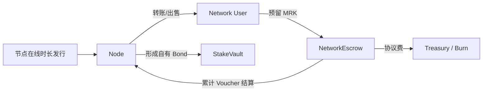

# MRK 专用结算账本、节点发行与治理协议

状态：方案草案（MVP）  
配套文档：[WSS 私网转发架构](./architecture.md)

> **预发布兼容性说明——正式发布时删除本段（`TODO(release): remove-pre-release-compatibility-notice`）。** 正式发布前，协议规则、持久化 Ledger Schema、Operation 格式和默认参数均可能发生不兼容修改，测试与预发布部署必须在不兼容变更后重新初始化 Ledger，不提供旧状态迁移保证。当前新建 Ledger 默认使用 1,800 秒 Epoch 和每 Epoch 500 MRK 铸币预算。兼容性承诺从正式发布版本开始。

## 1. 协议目标

MRK 使用 MRK 专用结算账本（MRK Settlement Ledger，MSL）完成四件事：

1. 允许任何人无需身份审批地运行 WSS Relay Node；
2. 只按照合格节点的可验证在线时长释放新 MRK；
3. 使用累计付款凭证把用户支付的 MRK 结算给实际提供流量转发的 Relay；
4. 记录节点状态、质押、治理和最终检查点。

MSL 不是通用区块链。它不承载 WSS 数据，不实现三层网络、通用虚拟机、用户智能合约、自定义代币、DeFi、NFT、跨链桥、公共 Mempool 或 Gas 市场。

## 2. 不可破坏的原则

### 2.1 不存在 Verified Human

协议不验证真人，不收集邮箱、社交媒体、证件或其他人类身份资料，也不存在：

- Verified Human、Provisional Human 或 Human House；
- HumanRegistry、AdmissionCourt、Sponsor、Juror 或 Guardian；
- Welcome Grant、Basic Grant、Usage MRK 或 UsageVault；
- 由身份、投票、贡献者或其他运行期渠道获得的新发行 MRK。

一个人可以控制任意数量的钱包或 Node。协议不声称识别多个 Node 是否属于同一现实控制人。

### 2.2 Genesis 后的新 MRK 只能因节点在线时长释放

Genesis 固定铸造 `500,000,000 MRK` 到无私钥协议国库。Genesis 完成后，唯一允许继续增加 `lifetime_minted` 的入口是 `NodeEmissionController`：

```text
mint(reason = eligible_node_uptime)
```

以下运行期行为均不得铸造 MRK：

- 注册钱包、创建私网或加入私网；
- 治理投票、开发贡献、邀请用户或提供审核；
- Validator 出批次或签署检查点；
- 节点自报流量、用户数、连接数或带宽；
- Treasury 支出、罚没返还或代币销毁。

协议费用、流量付款、Treasury 支出和罚没只能转移或销毁已经存在的 MRK，不属于新增发行。Genesis 国库铸造是唯一固定例外，数额不能由治理修改或重复执行。

### 2.3 流量收入与协议发行分离

节点有两类收入：

```text
节点发行收入 = 按合格在线时长分配的新 MRK
流量服务收入 = 用户通过累计 Voucher 支付的已有 MRK
```

流量收入不增加总供应。链下流量无法被账本可靠验证，禁止使用 `reported_bytes × rate` 直接增发 MRK。

### 2.4 MRK 是唯一协议资产

节点报价、流量结算、质押、治理保证金、固定操作费和罚没都只使用 MRK。MSL 不依赖其他链的 Gas Token。

## 3. 角色与密钥

| 角色 | 权利 | 责任 |
| --- | --- | --- |
| Account | 持有和转移可支配 MRK | 保护账户密钥 |
| Network Owner | 创建私网、签发成员凭证、预留付款预算 | 管理私网安全和余额 |
| Node | 运行一个 Relay、领取在线时长发行、参与节点治理 | 保持服务可用、接受锁定和处罚 |
| Validator | 进入最多 31 席委员会，重放 MSL 批次并投 PREVOTE/PRECOMMIT | 保存批次、验证状态根、不签署冲突状态 |
| Node 1 | 固定的 Genesis Node、启动期账本签名者和治理者 | 公开操作日志、检查点和启动信任边界 |

每个 Node 使用 `node_owner_key` 管理身份、治理和 Validator 共识，并签署独立 Relay 热密钥。协议没有 Operator 身份，也不创建单独的 Validator 密钥；加入委员会不改变 Node 身份。Node 密钥和私网 Owner 密钥必须分离。同一用户批量管理多个 Node 属于 CLI/钱包能力，不形成协议内角色。

## 4. MRK 总量和发行池

### 4.1 硬供应上限

```text
MAX_SUPPLY = 1,000,000,000 MRK
DECIMALS   = 18
GENESIS_TREASURY_MINT = 500,000,000 MRK
NODE_EMISSION_POOL    = 500,000,000 MRK
```

MSL Genesis 初始状态为：

```text
lifetime_minted = 500,000,000 MRK
treasury        = 500,000,000 MRK
pool_remaining  = 500,000,000 MRK
```

MSL 保存只增不减的 `lifetime_minted`，任何后续节点发行必须满足：

```text
lifetime_minted + mint_amount <= MAX_SUPPLY
```

销毁 MRK 不减少 `lifetime_minted`，也不恢复任何发行额度。Node 1、节点治理和软件升级均不能提高 `MAX_SUPPLY`。

### 4.2 Genesis 国库与节点发行池

| 节点发行类别 | 数量 | 规则 |
| --- | ---: | --- |
| Genesis 协议国库 | 500,000,000 MRK | Genesis 固定一次性铸造；没有私钥，只能由分布式治理支出 |
| 统一节点在线时长池 | 500,000,000 MRK | 按 Epoch 内合格 Node Seconds 比例释放 |
| 合计 | 1,000,000,000 MRK | 不存在团队、投资人、真人身份或早期节点额外奖励 |

未达到释放条件的节点额度始终留在节点发行池。Genesis 国库不属于 Node 1、团队、投资人或任何可导出私钥地址。

## 5. 无许可节点准入

### 5.1 成为 Relay Node

任何人都可以执行以下流程，无需 Node 1、节点治理或任何身份系统批准：

1. 生成 Node Owner Key 和独立 Relay 热密钥；
2. 由 Node Owner Key 签署 `RegisterNode` 操作；
3. 提交 WSS 端点、Relay 公钥、价格、能力上限和协议版本；Registry 自动解析 WSS Endpoint，形成用于奖励资格的候选公网 `reward_ip`；
4. Node 运行时重新校验解析结果，再由外部 Probe 从公网直接连接该地址，完成 IP 绑定和 WSS Challenge；
5. 除 Genesis Node 1 外，完成注册时固化的 `warmup_until` 考察期并持续通过公开可复验的 WSS Challenge；
6. 进入 `ACTIVE` 且 Availability Probe 达到法定票数后，开始累计合格在线秒数。

注册状态机：

```text
Genesis Node 1: REGISTERED -> ACTIVE -> DRAINING -> EXITED
Other Nodes:    REGISTERED -> WARMING_UP -> ACTIVE -> DRAINING -> EXITED
                              |
                              -> SUSPENDED
```

注册本身不获得 MRK；只有 `ACTIVE` 且通过在线验证的时间才能产生发行权重。

公共读取把“登记存在”和“当前可发现”分开：`mrk registry list/show` 读取终局 `NodeRegistry`，可以看到历史及非活跃状态；`mrk discover` 只返回 `ACTIVE`、最近已终局 Probe 仍在治理参数 `probe_validity_seconds` 窗口内、并且公网 IP 槽仍有效绑定的 Relay。列表按 `node_id` 升序并使用排他游标分页，单页上限 1,000。Heartbeat 是本机运维状态，不进入该筛选。对应公共 RPC 方法为 `node.list`、`node.get` 和 `node.discover`。

### 5.2 公网 IP 槽位

每个 Node 必须绑定一个可从公网直接访问的 `reward_ip`，但该地址不能由操作者手工提交。Registry 从已签名 WSS Endpoint 自动解析候选地址，Node 运行时复核，最终以外部 Probe 的直连验证结果确认。该地址经过规范化后形成唯一 `ip_slot`：

```text
IPv4 ip_slot = 完整 32-bit 公网 IPv4
IPv6 ip_slot = 公网 IPv6 地址的 /64 前缀
```

规则：

- 同一时间每个 `ip_slot` 最多只有一个 Node 可以成为 `REWARD_ELIGIBLE`；
- 同一 `ip_slot` 下的不同端口、域名、进程、容器或 `node_id` 不产生额外 Node Seconds；
- 该唯一性同时适用于在线发行、Governance-Eligible Node 和 Active Validator 资格；
- 双栈域名优先选择公网 IPv4；没有公网 IPv4 时选择规范排序后的首个公网 IPv6，多 A/AAAA 记录不能让一个 Node 获得多个槽位；
- IPv4 私网、环回、链路本地、组播、保留地址和 CGNAT 地址不合格；IPv6 非全局单播地址不合格；
- WSS 域名必须持续解析到已登记的 `reward_ip`，Probe 使用该 IP 直接连接并携带原域名 SNI，防止 DNS 轮换或重绑定伪造；
- 共享 CDN、共享反向代理或共享出口 IP 只能形成一个槽位；使用反向代理时必须拥有可独占验证的公网 IP；
- 第一笔最终确认的有效 IP 绑定占用槽位。后续冲突 Node 可以注册和提供服务，但在槽位释放前不能获得发行、治理或 Validator 资格；
- 更换 `reward_ip` 必须由 Node Owner Key 签名，重新进入 `WARMING_UP`，并等待新地址通过 Probe；
- Node 退出后，原槽位经过 `IP_REUSE_COOLDOWN` 才能绑定给另一个 `node_id`，防止在同一 Epoch 内轮换大量进程。

MVP 固定 `IP_REUSE_COOLDOWN = 7 days`。

公网 IP 验证只能提高批量节点成本，不能证明不同 IP 属于不同的人。拥有大量 IPv4、IPv6 `/64` 或云资源的控制者仍可运行大量合格 Node；共享 NAT 下的多个诚实节点则只能共享一个奖励槽位。

### 5.3 无启动质押

新 Node 不需要预先持有 MRK，也不以质押作为开始运行 Relay 的前提。节点最初获得的在线时长奖励优先形成协议要求的自有 Service Bond；达到最低 Bond 后，后续奖励才进入即时领取和线性释放流程。

```text
REQUIRED_SERVICE_BOND = 500 MRK

node_uptime_reward
  -> until 500 MRK Service Bond: 100% Service Bond
  -> after REQUIRED_SERVICE_BOND: 10% immediately claimable MRK
  -> after REQUIRED_SERVICE_BOND: 90% linearly vested over 180 days
```

MVP 要求的 Service Bond 为 500 MRK。Node 的 `DrainNode` 操作终局时进入 `EXITED`：已经进入 `claimable_reward` 的奖励仍归 Node，所有尚未归属的线性释放余额原子退回 Treasury，释放批次随即清空；这只是已铸 MRK 的状态转移，不回补节点发行池，也不改变 `lifetime_minted`。Service Bond 从该终局区块时间起按 `service-bond-unlock-seconds` 延迟解锁，默认 30 天，解锁后必须由 Owner Key 签署 `WithdrawServiceBond` 才能转入 Reward 账户。持有 Validator 身份或尚未取回 Validator Bond 的 Node 不得开始 Drain。

恶意停机使用终局 Availability 证明而非本机 Heartbeat 判断。具有历史成功证明的 `WARMING_UP`、`ACTIVE` 或 `DRAINING` Node，如果从 `last_probe_success` 起连续 `offline-slash-seconds` 没有新的终局成功证明，默认 7 天，则在下一终局区块中被强制置为 `EXITED` 并释放 IP Slot；全部 Service Bond 和尚未归属的线性释放余额原子转入 Treasury，Bond 不产生解锁时间，已归属的 `claimable_reward` 仍保留。该区块会记录罚没时间、Service Bond 数额和线性奖励数额。Reward IP 更新保留旧证明作为罚没计时基准，直到新地址取得首个成功证明，避免通过反复换 IP 重置离线时钟。若全网无法产生终局区块，状态机无法单独推进时间或执行罚没；恢复终局后由首个达到阈值的区块执行。

奖励先补足 Service Bond；扣除 Bond 后的部分使用当前 Epoch 的 `reward-immediate-bps` 与 `reward-vesting-seconds` 快照拆分。默认立即释放 `1,000 bps = 10%`，其余 90% 从该 Epoch 结算边界开始，在 180 天内线性释放。

### 5.4 Node 1

Node 1 是固定 `node_id = 1` 的第一个 Node。启动流程：

1. 生成单一 Node Owner Key；
2. Root Key 离线保存在硬件设备，Relay 热密钥单独生成；
3. Node Owner Key 签署 Genesis Relay、MSL 排序者和初始 Validator 配置；
4. 发布 Genesis 状态、MSL 二进制哈希、协议版本和第一个签名检查点；
5. 启动 WSS Relay 后，与其他节点使用相同在线时长规则累计 MRK。

Node 1 Owner Key 不适用协议内恢复或替代密钥。丢失时协议不恢复该权限；必须依赖硬件保管和多个物理位置的离线种子备份。

## 6. 按在线时长释放 MRK

### 6.1 固定 Epoch 铸币预算

MVP 使用 1,800 秒 Epoch，每个 Epoch 的默认铸币预算固定为 `500 MRK`，不随活跃 Node 数量变化：

```text
EPOCH_SECONDS = 1800
EPOCH_MINT_AMOUNT = 500 MRK
epoch_node_budget = min(EPOCH_MINT_AMOUNT, pool_remaining)
```

只要本 Epoch 至少存在一个具有合格在线秒数的 Node，完整预算就由所有合格活跃 Node 按权重瓜分；整数除法产生的最小单位余数按“小数余数从大到小、Node ID 从小到大”确定性分配，因此实际新增 `lifetime_minted` 恰好等于该 Epoch 预算。没有合格 Node 时不铸币，额度继续留在统一节点发行池。池余额不足时只发行剩余余额。

`epoch-mint-amount` 与 `epoch-seconds` 都是 Critical 治理参数。提案执行后只写入下一 Epoch 的配置；已经开始的 Epoch 始终使用起始时的铸币量和时长快照，不允许被提前结束、延长或追溯修改。默认值分别为 `500 MRK` 和 `1,800` 秒。改变 Epoch 时长会改变年度发行速度，因此不能用 Standard 提案修改。

每个节点的 Epoch 奖励先补足 Service Bond，再将扣除 Bond 后的奖励按当前 Epoch 快照拆分：`reward-immediate-bps` 默认 `1,000`，立即进入 `claimable_reward`；其余部分建立独立释放批次，按 `reward-vesting-seconds` 默认 `15,552,000` 秒（180 天）线性释放。只有最终确认区块的时间戳跨越 Epoch 边界时才结算释放；查询是纯只读操作，领取也只能转移此前已最终确认进入 `claimable_reward` 的金额，二者均不得按本机时间推进 Epoch。边界结算使用经过秒数计算最小单位整数结果，因此无需每秒写入账本。多个 Epoch 批次可以重叠，领取已释放部分不改变剩余批次。

对节点 `n`：

```text
reward_weight_n = eligible_node_seconds_n * validator_factor_n

validator_factor_n =
  1.25 if Node is Active Validator and checkpoint signature rate >= 95%
  1.00 otherwise

base_reward_n = floor(
  epoch_node_budget
  * reward_weight_n
  / total_reward_weight
)

reward_n = base_reward_n + deterministic_rounding_remainder_n
```

所有普通 Node 获得相同的每秒基础权重；履行额外检查点验证职责的 Active Validator 获得 25% 权重加成。该加成只重新分配同一个固定 Epoch 预算，不增加预算和 `lifetime_minted`。新增 Node 只会稀释现有 Node 的份额，不会扩大铸币量。流量、用户数、钱包余额和治理投票均不作为发行倍率。

### 6.2 合格在线秒数

一秒钟只有同时满足以下条件才计入：

- Node 已完成预热，端点和 Node Owner 签名未过期；
- Node 持有本 Epoch 唯一有效的公网 `ip_slot`；
- WSS/TLS 端点可公开访问并完成协议 Challenge；
- Active Validator 少于 7 个时处于 `NODE1_TRUSTED`，绝对信任 Genesis Node 1：Node 1 是唯一 Availability Verifier，可以验证自己或其他 Node，一票即构成法定证明；
- 在 Epoch 边界达到至少 7 个 Active Validator 后，Availability 切换为 `MULTI_VALIDATOR`：每个 60 秒 Slot 默认选择 5 个不同验证节点，至少 3 个提交有效证明才计入，且目标 Node 永远不能验证自己；跌破 7 个时自动回到 `NODE1_TRUSTED`；
- 节点没有处于 draining、暂停或处罚状态；
- 单 Epoch 累计值不超过实际墙钟时间。

本机 Heartbeat 只用于进程健康和运维诊断，既不进入状态根，也不产生 Node Seconds。每个被选中的验证节点使用 Owner Key 对 `(ledger_id, epoch, slot, target_node_id, verifier_node_id, role)` 签署唯一 Probe Ticket；Ticket 的哈希同时形成 Challenge 和 Slot 内检查时刻。目标 Node 在收到请求前无法计算其他验证者的 Ticket、Challenge 或准确检查时刻。验证者必须在协议窗口内直连登记的 `reward_ip`，同时使用 Endpoint 域名执行 TLS SNI/证书验证，再校验目标 Relay Key 的响应签名。状态机验证 Ticket、角色、被选资格、检查窗口和目标签名；每个验证节点对同一目标、Slot 和角色只能提交一次证明。

`MULTI_VALIDATOR` 阶段默认对 5% 的 Slot 执行二次审计。只有 Active Validator 至少 9 个、能够在排除目标和 5 个 Primary Verifier 后再选择 3 个不同 Auditor 时才启用审计；被抽中的 Slot 除 Primary 5 选 3 外，还必须由 Auditor 3 选 2。Primary Ticket 安排在 Slot 前段，Audit Ticket 安排在后段，二者使用不同签名域。任一法定票数不足都不产生该 Slot 的 Node Seconds。单次网络观测分歧不是可客观证明的恶意行为，因此只能拒绝该 Slot 奖励；只有同一签名者对相同协议对象双签等密码学证据才可罚没 Bond。

Availability 模式随 Active Validator 门槛双向切换：少于 7 个时写入 `NODE1_TRUSTED`，由 Genesis Node 1 单人证明；在 Epoch 边界达到至少 7 个时写入 `MULTI_VALIDATOR`。首次进入多 Validator 模式的激活时间和 Epoch 会进入状态根并永久保留，后续回退和恢复不覆盖该历史。Node 1 自证是协议明确接受的低节点数信任假设，不适用随机审计或虚假 Probe 处罚。

`warmup-seconds` 默认 `86,400` 秒（1 天），允许范围为 0 到 `31,536,000` 秒（365 天），属于 Critical 治理参数。除 Genesis Node 1 外，Node 注册时计算并写入不可追溯修改的 `warmup_until = registered_at + warmup_seconds`；后续治理修改只影响新注册 Node，既不能提前释放旧 Node，也不能让已经完成考察的 Node 重新进入考察期。Genesis Node 1 注册后直接进入 `ACTIVE`，写入 `warmup_until = registered_at` 与 `active_since = registered_at`；它没有考察期，但仍须取得有效 Availability Probe，才可为 Slot 累计 Node Seconds。

`mrk node run` 自动执行本节点到达秘密 Ticket 时刻的 Probe，并以有界并发和 10 秒单请求超时提交证明；`mrk node probe` 保留为人工诊断/补提入口，但同样不能绕过 Ticket 和时间窗口。Slot 时长、Primary 数量/法定票数、审计比例、Auditor 数量/法定票数都是 Critical 治理参数，默认分别为 60、5/3、5%、3/2。

CLI 只有一个 `mrk` 入口：所有单 Node 生命周期、Validator、共识、治理、出块、链验证和运行管理操作统一放在 `mrk node`；公网 WSS 查询或提交的普通账户操作放在 `mrk account`，区块和 Operation 查询放在 `mrk block`，国库和私网操作保留各自的顶层子命令。Governance 的签名主体始终是 Node Owner；国库提案、投票、否决、Finalize 和 Execute 因此由 `mrk node governance` 提交。Node Reward 地址仍可作为普通账户，通过 `mrk account balance --account node:<name>` 查询余额，通过 `mrk account transfer --account node:<name>` 发送交易。

Node 存储模式只有 `LITE` 和 `FULL`。`mrk node init --lite` 明确选择 `LITE`，普通 `mrk node init` 默认选择 `FULL`；模式写入 Node 配置并由 `mrk node status` 返回，不允许运行时静默改变。`LITE` 保存完整当前状态、已验证检查点和有界近期历史；`FULL` 保存完整区块和交易历史。模式不影响出块、验证、奖励或治理权。链状态使用纯 Rust 的 redb；正常运行期间只有常驻 `mrk node run` 进程打开数据库，其余 Node 管理命令通过同 UID、`0600` 权限的本地 Unix Socket 调用守护进程。唯一例外是守护进程已经停止后的显式离线恢复。

运行中的守护进程通过 `mrk node backup` 生成一致逻辑备份；备份包含完整 Ledger、Height、State Root 和对完整 Payload 的 SHA-256 Checksum，文件权限为 `0600`，默认路径不覆盖已有文件。`mrk node backup-verify` 可离线验证完整链；`mrk node restore` 只允许在守护进程停止后使用，并强制固定预期 State Root，再通过单个 redb 写事务恢复。生产 Validator 必须采用异机多副本并在升级前生成、校验和演练恢复。

`mrk node run` 在 `LITE` 模式下每 60 秒检查一次历史：保留最近 65,536 个 Block；Operation 正文按完整 Block 后缀保留，目标上限为 262,144 项（单个 Block 超过目标时仍完整保留）；每个账户的 Operation ID 历史索引最多保留最近 1,024 项。`PENDING` Operation 与余额、Nonce、节点、私网、治理和共识等当前状态不得裁剪。裁剪后的前缀以 `pruned_through_height/pruned_tip_hash/pruned_tip_timestamp` 形成本地检查点，后续出块、父哈希校验、共识高度与查询均从该检查点连续计算。查询已裁剪高度返回明确错误，`chain.status` 和 `chain.verify` 返回裁剪边界；实际删除完成后调用 redb compaction 回收磁盘空间。`FULL` 模式不执行任何历史裁剪。

Operation 正文、账户 Operation ID 索引和上述裁剪元数据属于本地历史，不进入状态根；因此同一高度的 `LITE` 与 `FULL` 节点计算相同状态根。保留区间内的区块仍验证父哈希、时间、生产者签名和 Validator Commit；Operation 正文可用的区间继续逐项验证签名承诺，检查点之前或 Operation 正文边界之前的内容明确记为已裁剪，而不是伪装成完整历史。

只有 `last_heartbeat` 是各机器独有的运行观测，不进入共识状态根，Catch-up 保留接收者自己的值。已签名 Availability Slot 证明、`last_probe_success`、Probe 次数、Epoch/累计合格秒数、账户余额、Nonce、Node 身份与状态、奖励结算结果、治理状态、Validator 委员会选择及双签证据都属于共识状态并受状态根约束；Catch-up 必须采用已验证检查点中的这些值。Proposal、轮内 Vote、Lock 和计时器属于临时共识对象。

公网链操作统一使用 WSS `/v1/rpc`（子协议 `mrk.rpc.v1`）；本地密钥、Node 生命周期和治理管理接口不得暴露到该端点。Validator 共识使用 WSS `/v1/consensus`：服务端和连接端分别用 Node Owner Key 签署新鲜 Challenge 与响应，认证后同步已签名待处理 Operation，并在相同 `(height, round)` 对齐 Proposal、PREVOTE 和 PRECOMMIT。落后节点通过 `CATCH_UP_REQUEST/CATCH_UP_CHUNK` 分块取得 Finalized Block、Operation 正文和最终检查点；本地必须验证链连续性、可信委员会法定人数连续、Commit Certificate、Operation 签名与状态根，禁止用未验证状态覆盖本地链。`mrk node run` 每 2 秒与最多 4 个确定性环形邻居（并确保当前 Proposer）自动 Gossip，每次同步最长 60 秒、单消息最大 16 MiB。各 Validator 使用独立 redb 数据目录；共享数据目录不是进程间共识协议。`LITE` 可从仍保留所需区间的 Peer 追赶，早于 Peer 裁剪点的请求会被明确拒绝。

全新非 Genesis Node 必须通过公开 WSS `chain.bootstrap` 下载终局检查点，并由操作者显式提供从独立可信渠道获得的高度和完整 `state_` SHA-256 根；快照 Peer 本身不能为该检查点提供信任。Peer 保留最近 256 个终局高度的不可变快照，并按指定高度返回，因此链继续出块不会使已固定的可信根失效。根、Ledger ID、高度、Genesis Authority 和空待处理池全部匹配后才原子安装，并记录该 Peer。此后普通 Node 无需成为 Validator，也会通过公开 `chain.catch_up` 提交本地签名候选和拉取 Finalized Block；每次仍执行与 Validator Catch-up 相同的链、委员会、Commit、Operation 和状态根验证。单次追赶超过 4,096 Block、请求的检查点已超出 256 Block 保留窗口，或越过 Peer 裁剪边界时停止自动安装，要求操作者固定新的可信检查点。

`mrk` 在客户端本地解锁密钥并签署完整 Operation；`/v1/rpc` 的 `operation.submit` 只接收公钥和签名对象。服务端验证 Ledger ID、协议版本、签名地址、Nonce、有效期和动作格式后进入有界待处理池。不同 Validator 即使以不同顺序收到冲突候选，也会按 `(valid_until, signer, nonce, operation_id)` 排序；提议者和投票者都从上一终局检查点用内存 redb 调用同一正式状态转换函数重放 Block 操作，状态根不一致时拒绝投票。当前适配覆盖 MRK Transfer、私网创建与充值、Member 签发与撤销；密码和私钥不得进入 WSS 请求。每个本地 `mrk node run` 使用独立 `--data-dir`，避免多个 Node 进程共享同一数据库文件。

### 6.3 Node 是协议原子单位

一个 `node_id` 对应一个可独立服务的 Relay 实例，也是在线奖励、Service Bond、Validator 资格和治理权的统一主体。运行多个 Relay 必须分别注册多个 Node、使用不同公网 `ip_slot` 并分别通过 Probe，才能分别累计 Node Seconds。

仅更换端口、域名或密钥但共享同一个不可独立服务的实例，不应被重复计时。协议不聚合多个 Node，也不验证其现实控制关系，因此同一人运行多个真实 Node 或创建节点农场属于明确剩余风险。

## 7. MRK 与流量结算

### 7.1 资金来源

用户必须使用可支配 MRK 为私网付款授权预留余额。用户获得 MRK 的方式只有：

- 自己运行合格节点并按在线时长获得；
- 从已有 MRK 持有人处接收或购买。

协议不为用户按身份免费铸币。用户可以从节点、已有 MRK 持有人或通过治理批准的国库支出获得 MRK；用户支付流量后 MRK 回到 Relay。国库付款和用户转账都只移动既有 MRK。

### 7.2 报价、押币和累计交付结算

```text
RelayQuote {
  node_id
  endpoint
  price_per_gib_mrk
  valid_from
  valid_until
  quote_nonce
  relay_signature
}

PaymentAuthorization {
  ledger_id
  payer
  node_id
  network_id
  sender_member_id
  receiver_member_id
  session_id
  price_per_gib
  max_amount
  created_at
  valid_until
  claim_until
  initiator_member_id
  spending_policy_revision
}

SenderCheckpoint {
  ledger_id
  protocol_version
  node_id
  authorization_id
  session_id
  direction
  sequence
  cumulative_sent_bytes
  transcript_hash
  checkpoint_at
  sender_member_id
  final_checkpoint
  sender_signature
}

ReceiverReceipt {
  ledger_id
  protocol_version
  node_id
  authorization_id
  session_id
  direction
  sequence
  cumulative_received_bytes
  transcript_hash
  sender_checkpoint_hash
  received_at
  receiver_member_id
  receiver_signature
}
```

Network Owner 向 Network Fund 充值并维护带 revision 的 `NetworkSpendingPolicy`，可随时更新或停用成员自动消费。Active Member 使用自己的 Member Key 签署 `ReserveSession`；状态机验证发起者、公钥、对端成员、Node 状态与报价，并按照策略的单会话额度、单 Member 并发预留上限和 Fund 可用余额原子确定 `max_amount`。最终 `PaymentAuthorization` 固定 Node、双方 Member、Session、报价、策略 revision 和过期时间；策略更新不追溯修改已经最终确认的授权。

每个方向独立维护累计 Sequence、真实 Payload 字节数和 Transcript Hash。窗口从第一个 DATA 开始，在累计 `16 MiB` 或经过 `15 秒`时结束，以先发生者为准；完全空闲不产生窗口和费用。到达边界后只暂停该方向的新 DATA，控制帧继续通行：Node 主动发送 `CheckpointRequest`，发送方签署 `SenderCheckpoint`，接收方校验同一累计前缀后签署 `ReceiverReceipt`。Node 验证并持久化完整双签名回执后才打开下一窗口。

窗口消息在链下交换。Node 把每个方向的最新完整回执覆盖写入本地 redb，默认每 5 分钟尝试提交一次；在此期间多个窗口自然聚合为一个累计前缀，崩溃重启后继续提交。`TrafficSettlement` 按链上已结算累计值计算增量：

```text
total_owed = ceil(new_cumulative_received_bytes × price_per_gib / 1 GiB)
amount = total_owed - settled_amount_for_direction
```

双向分别结算后相加。只计算去除流量整形 Padding 后的 Relay DATA Payload；TLS/WSS/Relay Header、控制帧、Heartbeat、Probe 和 Relay Proof 流量不计费。未被有效回执覆盖的押币在授权到期和 Node Claim Window 结束后退回 Network Escrow。

规则：

- Node 自报字节数没有结算效力；只有发送方 Checkpoint 与接收方 Receipt 的 Sequence、累计字节和 Transcript Hash 完全一致时才能结算；
- Node 不能领取超过 `PaymentAuthorization.max_amount` 的 MRK；每个方向只接受严格递增且不回退的累计前缀；
- 没有完整回执时 Node 必须拒绝该方向进入下一窗口，最大未结算风险被限制为每方向 `16 MiB` 或 `15 秒`；
- Node 不服务时无法取得接收方签名，未使用押币不会释放给 Node；
- Session 正常关闭时，两个方向分别为尾部发送带签名的 Final Checkpoint 并取得对端 Receipt；两方向都最终确认后，剩余预留立即退回 Network Fund。异常断线时 Node 最多损失当前未回执窗口；
- Node 把每个方向最新的完整双签名回执写入本地 redb，并以覆盖方式聚合；后台默认每 5 分钟提交，重启后继续领取。结算操作最终确认前不得删除本地回执；
- 未签尾部只存在于 Node 和客户端进程内存，不持久化。客户端进程重启后只能在本次 `mrk pipe` 或 `payment settle` 显式给出的 `max_auto_recovery_bytes` 范围内接受 Node 报告并补签；该参数不是链上 Network policy。Node 重启后精确尾部丢失，只能依据 Node Owner 的本地自动放弃策略或手动 Refund 收尾；
- 授权到期后保留 7 天 Relay Claim Window，随后由下一次自动预留回收未使用余额；
- 有效结算回执可把 `last_relay_receipt_at` 更新为布尔服务证据，但流量数量不得增加 Node Seconds、铸币、治理权或 Validator 权重；
- 自报流量、回执、Heartbeat 和 Probe 均不能从流量结算模块铸币；
- 结算分成只能转移或销毁已有 MRK，不增加 `lifetime_minted`。

### 7.3 流量费用循环



Treasury 初始持有 Genesis 固定铸造的 5 亿 MRK，之后还可以接收流量协议费、固定操作费中未销毁部分或罚没所得的既有 MRK；Treasury 支出不允许调用铸币入口。

### 7.4 可支配 MRK 直接转账

账户可以把可支配 MRK 直接转给任意 MSL 地址。转账使用普通 `SignedOperation`，payload 固定为：

```text
MRKTransfer {
  to
  amount_base_units
}
```

MSL 执行转账时必须原子检查并完成：

```text
spendable_balance >= amount + fixed_transfer_fee
sender_balance   -= amount + fixed_transfer_fee
receiver_balance += amount
burned          += fixed_transfer_fee
```

规则：

- `from` 由 `SignedOperation.signer` 唯一确定，payload 不允许另行指定付款方；
- 只能转移可支配 MRK，Service/Validator/Governance Bond 和 Escrow 余额不可转账；
- 金额以 8 位精度的整数最小单位编码，CLI 不得使用浮点数计算；
- 地址使用带 `mrk` 网络前缀和校验和的文本编码，错误网络或错误校验和必须在签名前拒绝；
- 转账不包含链上 memo，避免永久公开业务和个人信息；
- `operation_id = hash(canonical_signed_operation)`，重复提交同一操作只返回原结果；
- 每个账户 nonce 严格递增；同一账户的 CLI 必须串行分配 nonce；
- 操作最终确认后不可取消或回滚；超时前状态未知时应按原 `operation_id` 查询或重发同一签名操作，不得自动创建新 nonce 的第二笔转账。

MVP 使用 Ed25519 账户密钥、SHA-256 公钥摘要和 `mrk1` Bech32m 校验地址。固定转账费为 `0.001 MRK` 并全部 Burn，操作默认有效期为 10 分钟。

转账状态只允许：

```text
LOCAL_PREVIEW -> SIGNED -> SUBMITTED -> FINALIZED
                                  |-> REJECTED
                                  `-> EXPIRED
```

## 8. 节点治理

### 8.1 Node 1 启动治理

治理人数按 `GOVERNANCE_ELIGIBLE Node` 数量计算。Node 必须同时处于 ACTIVE、达到最低服务年龄、持有最低 Service/Governance Bond 且近期在线率达标，才进入该集合：

- 少于 20 个 Governance-Eligible Node 时，Node 1 拥有完整治理权；
- 达到或超过 20 个 Governance-Eligible Node 时，自动启用 Node Governance；
- 之后重新少于 20 个时，未执行提案取消，Node 1 自动恢复完整治理权；
- 节点注册始终无许可，Node 1 不审批符合客观协议条件的新节点。

Node 1 的完整治理权包括参数、暂停和账本升级，但不包括 Genesis Treasury 支出。少于 20 个 Governance-Eligible Node 时国库完全冻结，避免 Node 1 单独控制 5 亿 MRK。

当前 CLI 已执行完整动态边界：首个成功注册的 Node 固定取得 `node_id = 1`，其 Owner 地址和公钥写入 `genesis_authority`，以后注册、退出或 IP Slot 复用都不能替换。少于 20 个 Governance-Eligible Node 时，参数修改以及节点发行暂停/恢复必须由该 Owner Key 单签。达到 20 个时 Node 1 单签入口立即拒绝执行，并启用 Node Power 快照提案、投票和时间锁；降回 20 以下时，所有未执行分布式提案取消、保证金全额退还，Node 1 权限自动恢复。

当前可执行资格判定要求 Node 同时满足：`ACTIVE`、Service Bond 达标、累计已终局合格服务时间达到 `governance_min_service_seconds`（默认 30 天），且最近一个已确认 Probe 在有效窗口内。本机 Heartbeat 不参与治理权。发行暂停只停止新 Availability Slot 产生 Node Seconds，不暂停 Relay、无许可注册、用户转账或已获得奖励的领取。

出块门槛与治理门槛分离：只要 Governance-Eligible Node 少于 20 个，或 Active Validator 少于 4 个，就只有 Genesis Node 1 Owner Key 能签署 MSL Block。只有同时满足“至少 20 个治理合格 Node”和“至少 4 个 Active Validator”，Node 1 的手动、自动出块入口才关闭并切换多 Validator 共识。任一数量再次低于门槛时，未完成共识 Round 清除并由 Node 1 恢复出块；但只要治理合格 Node 仍不少于 20 个，Node 1 仅负责排序和出块，不能恢复单方面治理权。Node 1 不在线时不会由其他 Node 代替单签，Relay 数据面仍可继续转发。

签名操作提交后先标记为 `PENDING`。待处理池按 `(valid_until, signer, nonce, operation_id)` 形成规范顺序；同一 Nonce 的冲突签名或其他跨操作状态冲突仍作为候选 Gossip，不能因各节点先收到不同候选而永久分叉。多 Validator 提议者从上一终局检查点按规范顺序重放，Block 只收录重放成功的候选；投票节点独立重放 Block 中的有序 Operation，只有状态根完全相同才投票。未收录或无效候选在该 Block 终局时丢弃，调用方必须用新 Nonce 重试。Node 1 Block 收录后同样标记为 `FINALIZED` 并记录 `block_height`。每个 Block 固定承诺 `version/ledger_id/height/previous_block_hash/timestamp/producer_node_id/producer_owner_address/ordered_operation_ids/state_root`，以生产者 Owner Key 对规范 JSON 签名，并使用完整 256-bit SHA-256 形成 `block_hash`。每块最多收录 10,000 项操作；默认每 10 秒产生一个块。

### 8.2 可治理参数

少于 20 个 Governance-Eligible Node 时，Genesis Node 1 可直接提交参数修改：

```bash
mrk node --node <node-name> governance set \
  --parameter <parameter> \
  --value <value>
```

达到 20 个 Governance-Eligible Node 后，直接修改入口关闭，必须创建分布式提案：

```bash
mrk node --node <node-name> governance propose-set \
  --kind <standard|critical> \
  --title "<title>" \
  --parameter <parameter> \
  --value <value>
```

下表是 CLI 和状态机当前接受的完整参数集合。“最低提案类型”只约束分布式治理：标为 Critical 的参数不能放入 Standard 提案；标为 Standard 的参数也可以主动使用约束更严格的 Critical 提案。Node 1 直接治理不填写 `--kind`。除表中明确说明外，参数在直接治理操作最终确认或分布式提案执行后写入当前 Ledger Settings，并从后续状态转换开始使用。

| 参数 | 默认值 | 合法值与约束 | 最低提案类型 | 特殊生效语义 |
| --- | ---: | --- | --- | --- |
| `epoch-seconds` | `1,800` | `60..=31,536,000` 秒 | Critical | 当前 Epoch 不变，从下一个 Epoch 快照生效 |
| `epoch-mint-amount` | `500MRK` | `> 0` 且 `<= MAX_SUPPLY` | Critical | 当前 Epoch 不变，从下一个 Epoch 快照生效 |
| `reward-immediate-bps` | `1,000` | `0..=10,000` bps | Critical | 当前 Epoch 不变，从下一个 Epoch 快照生效；只影响新奖励批次 |
| `reward-vesting-seconds` | `15,552,000` | `1..=315,360,000` 秒 | Critical | 当前 Epoch 不变，从下一个 Epoch 快照生效；已建立批次期限不变 |
| `validator-weight-bps` | `12,500` | `10,000..=20,000` bps，即 `1.00x..=2.00x` | Critical | 无 |
| `validator-signature-threshold-bps` | `9,500` | `5,000..=10,000` bps，即 `50%..=100%` | Critical | 无 |
| `required-service-bond` | `500MRK` | `0..=MAX_SUPPLY` | Standard | 修改后会重新影响 Governance-Eligible 资格和后续奖励的 Bond 补足目标 |
| `service-bond-unlock-seconds` | `2,592,000` | `0..=31,536,000` 秒 | Critical | 只在后续 `DrainNode` 终局时快照为该 Node 的解锁时间；已有解锁时间不变 |
| `offline-slash-seconds` | `604,800` | `3,600..=31,536,000` 秒 | Critical | 从 Node 最近一次终局成功 Availability Probe 起计算；达到阈值的终局区块强制退出并罚没 Service Bond 与未归属奖励 |
| `warmup-seconds` | `86,400` | `0..=31,536,000` 秒 | Critical | 只写入修改后注册的非 Genesis Node 的 `warmup_until`，不追溯修改现有 Node |
| `heartbeat-grace-seconds` | `90` | `10..=3,600` 秒 | Standard | 无 |
| `probe-validity-seconds` | `300` | `30..=3,600` 秒，且不得短于 `availability-slot-seconds` | Standard | 修改后会重新影响 Probe 新鲜度和 Governance-Eligible 资格 |
| `availability-slot-seconds` | `60` | `60..=300` 秒，且不得长于 `probe-validity-seconds` | Critical | 无 |
| `availability-verifier-count` | `5` | `3..=30`，且不得小于 `availability-quorum` | Critical | `NODE1_TRUSTED` 阶段固定由 Node 1 一票验证；只作用于 `MULTI_VALIDATOR` |
| `availability-quorum` | `3` | `2..=21`，且不得大于 `availability-verifier-count` | Critical | `NODE1_TRUSTED` 阶段固定为 1 |
| `availability-audit-rate-bps` | `500` | `0..=10,000` bps | Critical | 只在 `MULTI_VALIDATOR` 且存在足够互不重叠 Auditor 时启用 |
| `availability-auditor-count` | `3` | `1..=10`，且不得小于 `availability-audit-quorum` | Critical | Auditor 必须与目标和 Primary Verifier 不同 |
| `availability-audit-quorum` | `2` | `1..=7`，且不得大于 `availability-auditor-count` | Critical | 被抽中审计的 Slot 必须同时达到 Primary 与 Audit 法定票数 |
| `ip-reuse-cooldown-seconds` | `604,800` | `0..=31,536,000` 秒 | Standard | 无 |
| `governance-min-service-seconds` | `2,592,000` | `0..=31,536,000` 秒 | Standard | 修改后会重新影响 Governance-Eligible 资格 |
| `block-interval-seconds` | `10` | `1..=300` 秒 | Standard | 影响后续自动出块间隔 |
| `validator-bond` | `50,000MRK` | `> 0` 且 `<= MAX_SUPPLY` | Critical | 修改后会重新影响 Validator Candidate 资格 |
| `max-active-validators` | `31` | `7..=31`，且当前 `max-validator-rotations <= floor(新值 / 3)` | Critical | 委员会在下一次资格刷新或 Epoch 选择时采用新上限；不可低于去中心化 Availability 恢复门槛 |
| `max-validator-rotations` | `10` | `1..=10`，且 `<= floor(max-active-validators / 3)` | Critical | 委员会在下一次 Epoch 选择时采用新上限 |
| `consensus-round-timeout-seconds` | `10` | `5..=30` 秒 | Critical | 影响后续共识 Round 超时判断 |

MRK 数值使用带单位的十进制文本，例如 `100MRK`；`MAX_SUPPLY` 当前固定为 `1,000,000,000 MRK`。bps 是万分比，`10,000 bps = 100%`。涉及成对约束的参数需要按可通过逐次校验的顺序修改；例如降低 Validator 委员会人数前，可能需要先降低 `max-validator-rotations`。

### 8.3 Node Power

每个 `node_id` 是一个治理身份。MRK 余额、Service Bond 和 Validator Bond 都不增加治理权，避免用资本直接购买治理权：

```text
raw_node_power = min(cumulative_eligible_service_days, 180)
per_node_cap   = max(1%, 1 / snapshot_node_count)
node_power     = min(raw_node_power, cap_resolved_power)
```

- 不使用流量、连接数或用户数增加治理权；
- 不使用 MRK 或 Validator 身份增加治理权；Validator Bond 只服务于共识准入和罚没；
- 单个 Node 上限随快照规模下降：20 Node 时 5%，40 Node 时 2.5%，100 Node 及以上时 1%；
- 协议不聚合同一控制人的多个 Node，拆分 Node 可以绕过单节点上限；
- 无最低 MRK 的新节点可以运行和赚取发行，但形成 Service Bond 并满足服务年龄后才能投票。

### 8.4 提案规则

| 提案类型 | 赞成门槛 | 最低参与率 | 投票期 | 时间锁 |
| --- | ---: | ---: | ---: | ---: |
| Standard：Relay、Probe、普通运行参数、暂停/恢复 | YES/(YES+NO) `>= 2/3` | 快照 Power `>= 50%` | 7 天 | 7 天 |
| Critical：发行、Validator、共识与协议安全参数 | YES `>=` 全部快照 Power 的 `2/3` | 门槛已包含参与要求 | 14 天 | 30 天 |

提案创建时固定 Node Power 快照并锁定 `PROPOSAL_BOND = 1,000 MRK`。正常完成投票后全额退还；普通提案未达到参与率时 20% 转入 Treasury、80% 退还。Governance-Eligible Node 数降到 20 以下时，所有未执行提案和时间锁取消并全额退还 Proposal Bond。

Treasury 支出强制属于 Critical 提案，且治理快照只包含累计合格运行满 180 天的成熟 Node；至少需要 20 个成熟 Node 和 4 个 Active Validator 才能创建。接收方必须是有效 MRK 地址，引用字段必须是 `sha256:<64 lowercase hex>`。提案必须同时取得成熟 Node 总 Power `2/3` YES 和提案快照 Validator 数量 `2/3` YES，投票 14 天并等待 30 天时间锁。

提案创建和执行时都检查单笔金额不得超过当时国库余额的 1%，过去滚动 90 天累计（含本笔）不得超过 2%，滚动 365 天累计不得超过 5%。时间锁期间，成熟快照 Node 可以提交签名 Veto；Veto Power 严格超过快照总 Power 的 `1/3` 时提案取消。国库没有私钥，CLI 不存在直接国库转账命令；执行只能由状态机按已通过提案完成。同一提案只能执行一次，降到 20 个治理合格 Node 以下时未执行支出自动取消。

节点治理不得创建新的非节点铸币渠道，也不得提高 `MAX_SUPPLY`。任何修改 `NodeEmissionController` 的升级必须保持“唯一原因是合格节点在线时长”这一不变量。

## 9. MSL 最小结算账本

### 9.1 固定状态机模块

MSL 只包含以下固定模块：

- `Asset`：余额、转账、销毁和硬供应上限；
- `NodeEmissionController`：Epoch 节点预算、Node Seconds 和唯一铸币入口；
- `NodeRegistry`：Node、Owner/Relay 密钥、端点、状态和报价；
- `StakeVault`：Service/Validator/Governance Bond；
- `NetworkRegistry`：私网承诺和 Owner；
- `NetworkEscrow`：付款授权、累计 Voucher 和结算；
- `NodeGovernor`：Node Power、提案、时间锁和 Treasury；
- `ValidatorRegistry`：Validator 集合、检查点签名、处罚和退出。

这些模块是同一个确定性状态机的固定逻辑，不是用户可部署的智能合约。

### 9.2 签名操作和批次

```text
SignedOperation {
  ledger_id
  protocol_version
  module
  action
  signer
  account_nonce
  valid_until
  payload
  signature
}

SettlementBatch {
  batch_height
  previous_checkpoint_hash
  timestamp
  operations_root
  events_root
  state_root
  proposer_id
  proposer_signature
}
```

每个账户 nonce 严格递增。Validator 必须取得并持久化完整批次，从上一状态根确定性重放，只有本地计算出的事件根和状态根一致才可签名。

### 9.3 Node 1 单签名阶段

- Node 1 排序、执行并签署追加式结算批次；
- SDK 持久化最近检查点并拒绝不连接该检查点的历史；
- 完整日志、状态根和快照必须公开，任何人可运行只读 Witness 重放；
- 同一高度的两个 Node 1 签名检查点构成可公开验证的冲突证据；
- 单签名阶段限制账户余额、单笔结算和系统总锁仓；
- 此阶段可审计但仍然完全依赖 Node 1 的可用性和最终签名。

### 9.4 多 Validator 最终确认

达到 20 个 Governance-Eligible Node 且至少存在 4 个 Active Validator 后启用等权委员会确认。正常 Node 不自动成为 Validator，必须主动从 Reward Key 对应的可支配余额锁定 `50,000 MRK` Validator Bond 才进入候选池。零至三个 Active Validator 时始终由 Node 1 出块：

- Active Validator 最多 31 个，每个 Node 最多一个席位；候选不超过 31 时全部入选；
- 候选超过 31 时按确定性服务顺序轮换，每个 Epoch 最多替换 10 席，至少保留 21 席；
- 提议者按高度和 Round 确定性轮换；基础 Round 超时为 10 秒，指数增长并封顶 60 秒，进入 Proposal 和取得 PREVOTE 法定票数时分别重置步骤计时；
- 每个高度执行 `PROPOSE -> PREVOTE -> PRECOMMIT`，`floor(2N/3)+1` 个匹配 PRECOMMIT 形成 Commit Certificate 后最终确认；停滞 Proposal 超时后换轮，取得 PREVOTE 法定票数的值必须跨轮重提，已锁定 Validator 只能接受相同状态根和有序 Operation 集；
- Validator 使用已有 Node Owner 单密钥签名。共识消息使用独立 WSS `/v1/consensus` 通道和 `mrk.consensus.v1` 子协议，不与 Relay DATA 混用；
- 已最终确认检查点不可重组、覆盖或回滚；锁定规则禁止 Validator 在同一高度投向冲突值；
- 同一高度、Round 和投票类型的冲突有效签名形成 Double-Sign Evidence，罚没 100% Validator Bond；
- 主动退出后等待 30 天，并且离开 Active Committee 后才可取回 Bond。

Validator 不拥有独立铸币入口。Active Validator 在本 Epoch 检查点签名率达到 95% 时，其合格 Node Seconds 使用 `1.25×` 权重参与统一节点预算；未达标时按普通 Node 的 `1.00×` 计算。该奖励不会提高 Epoch 总发行量。

### 9.5 固定操作费

MSL 不使用 Gas。每种有成本或可被滥用的财务/治理操作使用固定 MRK 费用和请求大小/速率上限，固定费用默认全部 Burn。`RegisterNode`、Heartbeat、Probe 结果和 Epoch 在线奖励入账不得要求调用方预持 MRK；它们通过签名、公网 IP 槽位、预热期、批量上限和速率限制抗垃圾请求。操作费销毁不恢复发行额度。

## 10. 安全边界

| 风险 | 主要约束 | 剩余风险 |
| --- | --- | --- |
| 同一公网 IP 启动大量进程抢发行 | IPv4 一地址一槽位、IPv6 每 `/64` 一槽位、IP 重用冷却 | 多端口、多进程和多密钥不能增加该 IP 的奖励 |
| 购买大量公网 IP 抢发行 | 固定 Epoch 预算、独立 Probe | 节点农场可稀释诚实 Node 的份额，但不能增加 Epoch 铸币总量 |
| 伪造在线时长 | 随机 Challenge、多 Probe 确认、墙钟上限 | Probe 串谋和网络位置偏差 |
| 自报虚假流量增发 | 流量模块没有铸币权限 | 虚假流量仍可在关联账户间转移已有 MRK |
| Relay 超额扣款 | 付款方签名累计 Voucher、Escrow 上限、nonce | 终端密钥泄露仍可能导致损失 |
| Voucher 重放 | 账本/版本/Relay/Session 域分离和累计序号 | 实现错误仍需测试向量覆盖 |
| Node 1 改写启动历史 | SDK 固定检查点、公开 Witness、冲突签名证据 | 单签名阶段仍能审查或停止服务 |
| Validator 冲突签名 | `>2/3` 最终性、100% Bond 罚没 | 少于 4 个 Validator 时没有 BFT 容错 |
| Validator 只挂名不验证 | 只有检查点签名率达到 95% 才获得 1.25× 在线权重 | 网络分区可能让正常 Validator 失去本 Epoch 加成 |
| 治理节点农场 | 公网 IP 槽位、服务年龄、纯运行时间 Power、动态 `max(1%, 1/N)` 上限 | 同一控制人的多个真实公网 Node 无法彻底识别 |

## 11. MVP 实施顺序

### 阶段 A：WSS 与 Node 1 MSL

- 完成 WSS 不透明字节转发、报价、Escrow 和累计 Voucher；
- 启动 Node 1 单签名 MSL、追加日志、检查点、快照和 Witness；
- 使用测试 MRK 验证重复领取、超额扣款和状态重放全部失败。

### 阶段 B：节点在线发行

- 开放无许可 `RegisterNode`；
- 实现公网 IP 槽位、Heartbeat、随机 Probe、Node Seconds 和 Epoch 固定预算；
- 启用零预质押启动、奖励自动形成 Service Bond；

### 阶段 C：多 Validator 与节点治理（当前 CLI 已实现核心状态机）

- 已实现 31 席确定性委员会、每 Epoch 最多 10 席轮换和 `>2/3` Commit Certificate；
- 已实现 Owner-key WSS 共识握手、提案/投票同步、Double-Sign Evidence 和 30 天退出；
- 已实现 Node Power、20 Node 动态治理阈值、提案快照、保证金和时间锁；
- 生产部署仍需独立历史复制、快照下载、自动 Peer Discovery 和跨数据目录 Catch-up。

## 12. 正式实现前必须确定

1. Probe 的地理分布、随机来源和一个 Relay 实例被认定为独立可服务节点的客观资源条件；
2. Service Bond 除长期缺少终局 Availability 证明外的客观罚没证据，以及 Validator Bond 的治理处置流程；两者主动退出解锁期当前默认均为 30 天；
3. 流量结算中的 Relay、Treasury 和 Burn 分成比例；
4. MSL 跨节点状态编码、快照格式、数据保留周期和 Catch-up 协议；
5. 单签名阶段的账户余额、单笔结算和系统总锁仓上限；
6. Treasury 支出的预算分类、收款证明和链下审计流程；
7. 节点农场与 Probe 串谋的监测、申诉和误判处理方法。

## 13. 核心不变量

- `MAX_SUPPLY` 永远为 1,000,000,000 MRK；Genesis 只向无私钥国库固定铸造 500,000,000 MRK，节点发行池固定为 500,000,000 MRK；
- `lifetime_minted` 只增不减，Burn 不恢复任何发行额度；
- Genesis 之后 `NodeEmissionController` 是唯一铸币入口；
- Genesis 之后的新 MRK 只能按合格 Node Seconds 从统一节点在线时长池释放；
- 不存在真人身份、免费用户额度、团队、贡献者或 Validator 出批次铸币；
- 少于 20 个运行满 180 天的成熟治理 Node 或少于 4 个 Active Validator 时国库冻结；支出必须同时获得成熟 Node Power `2/3` YES 和 Validator `2/3` YES，等待 30 天，并受单笔 1%、滚动 90 天 2%、滚动 365 天 5% 上限约束；
- 注册 Relay 不需要预持 MRK，也不需要任何人审批；
- 同一公网 IPv4 或 IPv6 `/64` 同一时间最多一个 Node 获得发行、治理和 Validator 资格；
- 新节点先运行并赚取 MRK，再由奖励自动形成 Service Bond；
- 每 Epoch 默认固定铸造 500 MRK，由合格活跃 Node 按权重完整瓜分，活跃 Node 数量不得改变预算；
- Active Validator 只有签名率达到 95% 才获得 1.25× 权重，且加成不得提高 Epoch 总预算；
- 自报流量、用户数、连接数和钱包数量不会增加发行；
- Relay 不能领取超过付款方签名累计金额和 Escrow 预留金额的 MRK；
- 可支配 MRK 转账必须由付款账户签名、使用严格递增 nonce，并原子扣除金额和固定费用；
- 同一签名转账重复提交不得重复扣款，最终确认后不可回滚；
- 流量收入是已有 MRK 转移，不属于发行；
- 少于 20 个 Governance-Eligible Node 时 Node 1 单独治理，达到 20 个时切换节点治理，之后低于 20 个时恢复；
- Governance-Eligible Node 少于 20 个或 Active Validator 少于 4 个时只有 Node 1 签署最终区块；两项门槛同时满足才切换多 Validator，任一门槛失守即恢复 Node 1 出块；
- 节点注册在所有治理阶段都保持无许可；
- WSS DATA 和单个数据包永远不进入 MSL；
- 每个结算批次链接前序检查点并承诺操作根、事件根和状态根；
- 多 Validator 阶段批次必须获得超过 `2/3` 签名，最终确认后不可重组；
- Active Validator 不超过 31，每个 Epoch 最多轮换 10 席，并至少保留 21 个上届席位；
- 所有发行、结算、转账、罚没和治理结果都有可审计的 MSL 事件和最终检查点。
